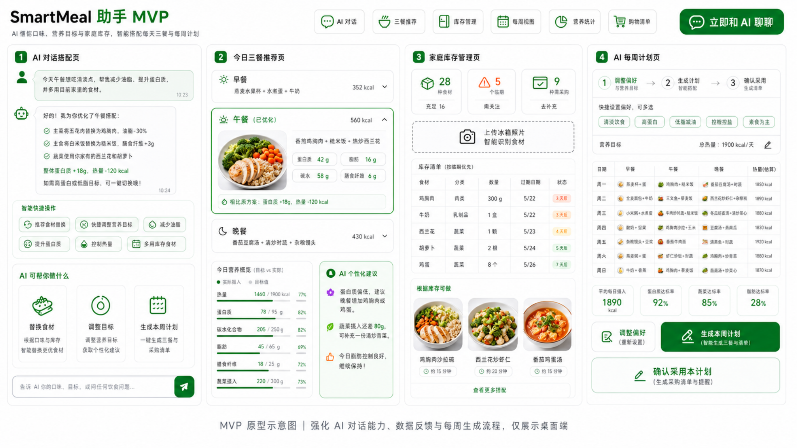

# SmartMeal 助手 MVP

SmartMeal 是一个面向家庭饮食管理场景的 Web 端 MVP 原型。项目围绕一个可演示闭环展开：用户通过 AI 对话表达饮食需求，系统结合库存和营养目标，生成今日三餐、营养反馈、每周计划和购物清单。

当前仓库提供的是前端原型版本，重点验证信息架构、核心交互和演示流程，还没有接入后端 API、真实 AI 模型或持久化存储。



## 项目目标

- 用 AI 对话作为饮食规划入口，降低“今天吃什么”的决策成本
- 把三餐推荐、营养反馈、库存使用和购物清单串成一个连续工作流
- 用可操作的前端原型验证产品方向，再逐步接入后端和真实 AI 能力

## 当前功能

### 已完成

- 总览页：集中展示今日状态、关键指标、三餐预览和 AI 摘要
- AI 对话页：支持输入、快捷操作、mock 回复和执行结果工作区
- 今日三餐：支持查看早餐、午餐、晚餐，展开详情和单餐替换
- 营养概览：根据当前推荐结果计算热量、蛋白质、碳水、脂肪和膳食纤维
- 库存管理：支持手动新增库存、临期状态展示和库存概览
- 每周计划：支持偏好切换、生成本周计划、单日微调和确认采用
- 购物清单：按分类展示采购项，并支持勾选已购买

### 暂未实现

- 后端 API
- 真实 AI 结构化生成
- 持久化存储
- 购物清单下载或打印
- 库存图片识别

## 产品范围

当前原型覆盖的核心页面：

- `overview` 总览
- `chat` AI 对话
- `today` 今日三餐
- `inventory` 家庭库存
- `weekly` 每周计划
- `nutrition` 营养统计
- `shopping` 购物清单

页面切换基于 `src/app/App.tsx` 内的 hash 路由状态实现，没有引入 React Router。

## 技术栈

| 类型 | 选型 |
| --- | --- |
| 构建工具 | Vite 7 |
| 前端框架 | React 19 |
| 语言 | TypeScript 5 |
| 样式 | CSS Modules + `src/styles/global.css` |
| 图标 | lucide-react |
| 包管理 | npm |

## 快速开始

### 1. 安装依赖

```powershell
npm install
```

### 2. 启动开发环境

```powershell
npm run dev
```

默认使用 `vite --host 0.0.0.0` 启动。

### 3. 生产构建

```powershell
npm run build
```

### 4. 预览构建产物

```powershell
npm run preview
```

## 目录结构

```text
.
├── AGENTS.md
├── docs
├── artifacts
├── src
│   ├── app
│   ├── components
│   ├── data
│   ├── features
│   ├── styles
│   ├── types
│   └── utils
├── package.json
└── vite.config.ts
```

## 核心业务模块

项目当前围绕这些领域对象组织：

- `UserProfile`：营养目标、口味偏好、饮食限制
- `InventoryItem`：库存食材、数量、过期日期和状态
- `MealRecommendation`：单餐推荐，包含营养、食材、做法和 AI 提示
- `NutritionSummary`：推荐结果与目标值的差异和评分
- `ShoppingListItem`：购物项、分类、购买原因和完成状态
- `WeeklyPlanDay`：每周计划单日数据

核心类型定义位于 `src/types/smartmeal.ts`。

## 设计原则

- 当前只做 Web 端工作台体验，不按移动 App 信息架构设计
- 中文文案保持短、清楚、可操作
- 视觉方向偏“温和健康工具”，绿色用于主操作和正向状态
- 模块以演示闭环优先，不预设后端或真实 AI 已经存在

## 文档参考

`docs` 目录包含产品和开发拆解资料：

- `docs/prd.txt`：产品需求文档
- `docs/smartmeal-mvp-dev-breakdown.md`：MVP 范围、数据模型和 API 草案
- `docs/smartmeal-mvp-task-list.md`：前后端与 QA 任务拆分
- `docs/mvp.png`：原型示意图

## 当前状态

| 范围 | 进度 | 说明 |
| --- | ---: | --- |
| 前端 MVP 演示闭环 | 96% | 已具备总览、对话、三餐、库存、营养、购物清单和每周计划演示能力 |
| 整体 MVP | 54% | 后端、真实 AI、持久化和 API 合约仍未落地 |

## 下一步

1. 设计并实现后端 API 合约
2. 用真实数据层替换本地 mock 数据
3. 接入结构化 AI 输出和 schema 校验
4. 增加失败降级和持久化能力

## 验证说明

当前仓库没有 `test` 或 `lint` 脚本。代码改动后的最低验证方式：

```powershell
npm run build
```

只修改文档时，至少用 UTF-8 读取确认内容正常。
